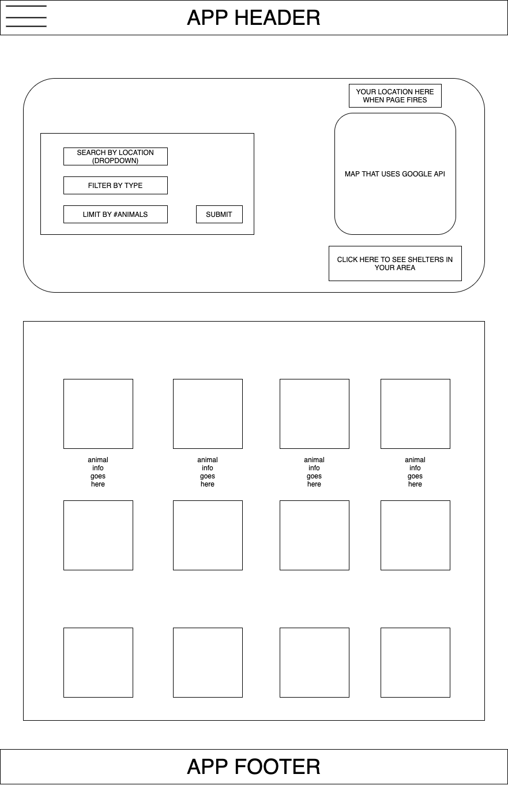

# Project-01

## Pet Adoption App for Rescue Animals from Shelters (Name in Progress)

## Team

* Bradley Wilson
* Joe Cooler
* Fabian Ramirez
* Brian Emmons

## API’s / Other Technologies Used

* Geolocation
* Google Maps
* Petfinder
* Wing CSS (alternative CSS) *maybe*

## Basic Function

Our app takes the user’s location either by a geolocation API or by user inputting city/state. This information is then used in conjucture with Google Maps API to display map and all pets for adoption in their search area. The Petfinder API links them with local animal shelters with pets for adoption. User can also input desired breed / age of pet(s) and the API will link them to available rescue pets in their area.

## Under The Hood

* Store responses to Firebase (for keeping/deleting data)
* Use browser geolocation to pull location based on current location (lat and lon) automatically
* localStorage lat/long (store city of where user is searching from)
* Add forms / buttons to allow user to input desired city/state (if searching outside of their geolocation)
* Add forms / submit buttons for searching for breed / age of desired pet
* Have pet images and descriptions pulled from petfinder show up on HTML

## Sketch / Wireframe

## Initial Tasks

* Develop project idea
* Create Wireframe Sketch (basic outline, will revise later)
* Figure out how our API's work
* Learn how to collaborate efficiently via Github (work flow and progress board)
* Potentially learn Wing CSS
* Pseudocode the key components of application
* Divide those coding tasks and responsibilities between team members
* Build the front end
* Make the design responsive

## Pseudocode

<!— PSEUDOCODE FOR PROJECT 01 —>

<!— STEP ONE: SET THE VARIABLES —>

<!— Set Arrays for different pets based on search criteria —>
<!— Set variables for lat & long to address —>
<!— Set up variables for API Keys (Petfinder / Google Maps) —>

//==================================================================================//

<!— STEP TWO: SETTING UP FUNCTIONS —>​

<!— AJAX calls for each API used returning responses —>

<!— Listening / Click Events for: —>
<!— Submit Button: —>
<!— 1. grab user location and pass it into initial Petfinder API call. —>
<!— 2. grabs parameters from search fields based on user input —>
<!— 3. displays images and information based on user search and initial page load —>

<!— Search for Shelters Button: —>
<!— 1. grab user location and pass it into Google Maps API —>
<!— 2. use Google Maps API to add marker position for all shelters in local area —>
<!— 3. have Info Window display information about selected shelter when user hovers over —>

<!— Function for adding Marker to Map: —>
<!— 1. establish URL for request passing search arguments —>
<!— 2. open new request to Google to update map based on arguments —>
<!— 3. parse JSON into readable format —>
<!— 4. create new marker and set it to coordinates —>

<!— Function for Tooltip: —>
<!— 1. grabs the response from Petfinder API —>
<!— 2. displays information about each pet when cursor is hovered over picture —>

//==================================================================================//

<!— STEP THREE: JQUERY / HTML —>

<!— Dynamic Loading of HTML (this will be the automatic loading of pets to HTML page from the array, Google Map displaying, etc) —>
<!— Expand upon wireframe front end —>
<!— Once functions are set and working, linking to the HTML with JQuery —>
<!— Making page dynamic and mobile responsive using Bootstrap / CSS / Wing —>
<!— Beautifying page and cleaning up JS / HTML to make more readable and presentable —>
<!— Launch MVP! —>

//==================================================================================//

<!— STEP FOUR: PRESENTATION —>

<!— 1. establish the purpose of our application —>
<!— eg: what problem does our app solve? how does our app allieviate this problem? —>

<!— 2. give a 10 minute presentation on the functionality of app —>
<!— eg: technologies used / what’s under the hood and how it works —>

<!— 3. list any issues had and how we worked around them —>

<!— 4. ??? —>

<!— 5. Profit! —>

//===================================================================================//

## Screenshots / Misc

